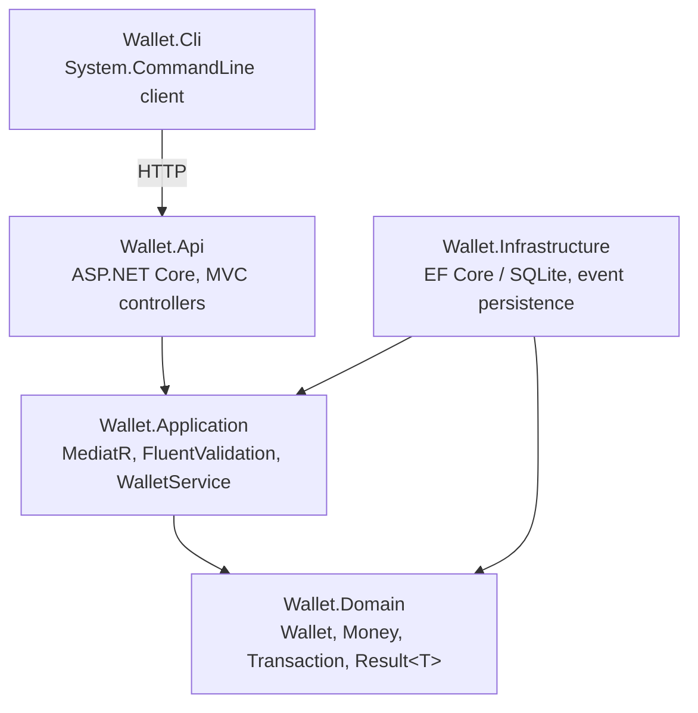

# Sanlam Wallet

A small wallet service: check a balance, withdraw funds, never go negative. Scoped deliberately small, with the trade-offs below made explicit rather than hidden.

## Solution overview

- **Wallet.Domain**: `Wallet` aggregate (private setters, `Withdraw(decimal amount)` rejects a
  non-positive amount or insufficient funds at the point of mutation, optimistic-concurrency
  `Version`), immutable `Money` value object (validates amount/currency in its constructor),
  `Transaction` (a plain record of a completed withdrawal), `WalletErrors`/`Error`/`Result<T>`,
  the `FundsWithdrawn` event and its `EventEnvelope` wrapper. No framework dependencies.
- **Wallet.Application**: CQRS via MediatR, organized by request-kind (`Commands/`, `Queries/`,
  `Handlers/`, `Validators/`, `Models/`, `Mappers/`). `WalletService` owns orchestration: loads
  the wallet, delegates the withdrawal rule to `Wallet.Withdraw()`, builds the ledger row, retries
  once on a concurrency conflict, publishes the event once the write succeeds. `WithdrawValidator`
  (FluentValidation, run through a MediatR `ValidationBehaviour`) pre-checks input shape plus
  wallet-exists/sufficient-funds up front, so a doomed request fails fast with a friendly 4xx;
  `Wallet.Withdraw()` re-enforces the same funds/amount rule at the point of mutation, since a
  validator result can go stale between the check and the write.
- **Wallet.Infrastructure**: EF Core over SQLite (`WalletDbContext`, `WalletRepository`),
  `WalletSeeder`, and `DbEventPublisher`, which persists each `FundsWithdrawn` event (wrapped in
  an `EventEnvelope`) to an `Events` table.
- **Wallet.Api**: ASP.NET Core Web API with MVC controllers (`WalletsController`), Swagger,
  health checks, correlation-id middleware, `ProblemDetails` error responses.
- **Wallet.Cli**: a `System.CommandLine` client demonstrating `balance` and `withdraw` against
  the API.



`Wallet.Cli` only talks to `Wallet.Api` over HTTP, with no project reference to any other layer.
`Wallet.Domain` has no framework dependencies and is referenced by every other project; nothing
depends on `Wallet.Api` or `Wallet.Cli`, keeping the dependency direction one-way inward. Handlers
never touch `DbContext` directly; every handler calls `WalletService`, which calls
`IWalletRepository`.

## API

| Operation        | Endpoint                               | Success | Failure |
|-------------------|-----------------------------------------|---------|---------|
| Get balance       | `GET /api/wallets/{id}/balance`         | `200`   | `404` unknown wallet |
| Withdraw funds    | `POST /api/wallets/{id}/withdrawals`    | `201`   | `400` invalid input · `404` unknown wallet · `409` concurrency conflict · `422` insufficient funds |

Withdraw requires an `Idempotency-Key` header so a retried request (client timeout, network blip)
doesn't double-withdraw: a repeated key returns the original result instead of reprocessing.

## Withdrawal sequence

```mermaid
sequenceDiagram
    actor Client as Client (CLI / Swagger)
    participant Api as WalletsController
    participant Pipeline as MediatR pipeline
    participant Validator as WithdrawValidator
    participant Handler as WithdrawHandler
    participant Service as WalletService
    participant Repo as WalletRepository
    participant Db as SQLite (Wallets / Transactions)
    participant Events as DbEventPublisher

    Client->>Api: POST /wallets/{id}/withdrawals<br/>Idempotency-Key, { amount }
    Api->>Pipeline: Send(WithdrawCommand)
    Pipeline->>Validator: amount > 0, wallet exists, sufficient funds

    alt validation fails
        Validator-->>Pipeline: ValidationException
        Pipeline-->>Api: (thrown, mapped by ErrorCode)
        Api-->>Client: 400 / 404 / 422 ProblemDetails
    else validation passes
        Pipeline->>Handler: Handle(WithdrawCommand)
        Handler->>Service: WithdrawAsync(walletId, amount, idempotencyKey)

        Service->>Repo: GetForUpdateAsync(walletId)
        Service->>Repo: GetByIdempotencyKeyAsync(walletId, key)

        alt key already processed
            Repo-->>Service: existing Transaction
            Service-->>Handler: Result.Ok (original result, no mutation)
        else new withdrawal
            Service->>Service: wallet.Withdraw(amount)<br/>(domain: amount > 0, sufficient funds, decrement, bump Version)
            Service->>Repo: SaveAsync(wallet, transaction)
            Repo->>Db: UPDATE Wallets WHERE Version = expected<br/>INSERT Transactions (one DB transaction)

            alt Version mismatch
                Db-->>Repo: DbUpdateConcurrencyException
                Repo-->>Service: ConcurrencyConflictException
                Service->>Service: retry once from GetForUpdateAsync
            else unique index violation (idempotency race)
                Db-->>Repo: DbUpdateException
                Repo-->>Service: DuplicateWithdrawalException
                Service->>Repo: GetByIdempotencyKeyAsync (re-check)
                Repo-->>Service: winning Transaction
            else success
                Db-->>Repo: committed
                Repo-->>Service: ok
                Service->>Events: PublishAsync(FundsWithdrawn)
                Note right of Events: separate SaveChangesAsync,<br/>best-effort, not atomic with the withdrawal
                Events->>Db: INSERT Events
            end

            Service-->>Handler: Result.Ok(WithdrawalDto)
        end

        Handler-->>Api: Result&lt;WithdrawalDto&gt;
        Api-->>Client: 201 Created (WithdrawalResponse)<br/>or 409 / 422 / 404 ProblemDetails
    end
```

## Technical choices and rationale

- **SQLite**: zero local setup (no Docker/DB server to start), while still a real relational DB
  with transactions and constraints. Swappable for SQL Server/Postgres via the connection string
  and EF provider only; `Wallet.Application`/`Wallet.Domain` are DB-agnostic.
- **Withdrawal correctness is enforced at four layers, not one:**
  1. Domain: `Wallet.Withdraw()` rejects a non-positive amount or insufficient funds at the point
     of mutation; the aggregate can't be pushed into an invalid state no matter what calls it.
  2. Validation: `WithdrawValidator` pre-checks the same rules before the handler even runs, so a
     doomed request fails fast with a friendly 4xx instead of reaching the domain layer.
  3. Service: `WalletService` re-fetches the wallet immediately before writing and retries once on
     an optimistic concurrency conflict (`Version` token), so two concurrent withdrawals can't
     both succeed against a stale balance.
  4. Database: a `CHECK (Balance >= 0)` constraint as a final backstop, plus a unique index on
     `(WalletId, IdempotencyKey)` that turns a raced duplicate request into a clean constraint
     violation rather than a double withdrawal.
- **A simple `Events` table, not a transactional outbox.** `DbEventPublisher` persists each
  `FundsWithdrawn` event to an `Events` table *after* `WalletRepository.SaveAsync` has already
  committed the wallet update and ledger row: a separate `SaveChangesAsync`, not the same
  transaction. Simpler than an outbox (no background dispatcher, no poll loop, no dead-letter
  bookkeeping), but best-effort: a crash between the two writes loses the event, never the
  withdrawal. Documented in code (see the comment on `DbEventPublisher`) and under Trade-offs
  below, rather than hidden.
- **`IEventPublisher`** is the seam a real broker (Kafka, Service Bus) or an atomic outbox would
  implement later without touching `WalletService`; the default `DbEventPublisher` just persists
  to a local table, keeping the whole thing runnable with `dotnet run` and no external services.
- **Concurrency handling: idempotency keys plus optimistic concurrency, chosen from the start.**
  Two different races have to be handled on a withdrawal: a client retrying after a timeout (is
  this a duplicate, or a new request?), and two requests landing on the same wallet at once (does
  the second one see a stale balance?). Idempotency keys solve the first (required on every
  withdrawal, enforced with a unique index on `(WalletId, IdempotencyKey)`); the `Version` token
  plus a single retry solves the second (see the four layers above). The concurrency tests
  (`ConcurrencyTests`: 20 concurrent withdrawals against a fixed balance, and two concurrent
  requests sharing one idempotency key) were written first, to pin down the exact race being
  defended against, before the retry logic existed.
- **`Result<T>` over exceptions** for expected failures (not found, insufficient funds); keeps
  exceptions for actually-exceptional cases (concurrency conflicts, constraint violations at the
  DB level).
- **The domain enforces its own invariant.** `Wallet.Withdraw()` and `Money`'s constructor reject
  invalid state directly: a negative amount, insufficient funds, or an invalid `Money` can't be
  constructed or applied no matter what calls them. `WalletService` still owns orchestration
  (persistence, retries, idempotency, events); it delegates the withdrawal rule itself to the
  aggregate rather than duplicating the balance math in the service layer.
- **`TimeProvider`** it's built into .NET,
  `WalletService` takes it via constructor injection, and
  `Microsoft.Extensions.TimeProvider.Testing`'s `FakeTimeProvider` lets tests pin `RequestedAt`/
  `AsOf` to an exact, known instant instead of asserting against `DateTime.UtcNow` with a
  tolerance, giving deterministic, non-flaky time-based assertions with no hand-rolled clock
  interface.

## Setup and run instructions

Requires the [.NET 9 SDK](https://dotnet.microsoft.com/download).

```bash
# Run the API (applies migrations and seeds a wallet on startup)
dotnet run --project src/Wallet.Api
# → Swagger UI at http://localhost:5126/swagger (Development environment)

# Run the tests
dotnet test

# Use the CLI (in another terminal)
dotnet run --project src/Wallet.Cli -- balance 00000000-0000-0000-0000-000000000001
dotnet run --project src/Wallet.Cli -- withdraw 00000000-0000-0000-0000-000000000001 100
```

No external services required: SQLite is a local file (`wallet.db`), created and migrated
automatically on first run.

The CLI defaults to `http://localhost:5126`, matching the API's `http` launch profile. Override
it with `WALLET_API_BASE_URL` if you're running the API on a different port (e.g. the `https`
profile on `https://localhost:7148`).

## Initial data

A wallet with id `00000000-0000-0000-0000-000000000001` is seeded with a balance of **1000.00
ZAR** on startup if it doesn't already exist.

## Assumptions

- One wallet is sufficient to demonstrate the operations; a wallet-creation endpoint was
  explicitly out of scope, so the seeded wallet's id is fixed and documented here.
- Currency is a fixed 3-letter code stored per wallet; no conversion or multi-currency logic, per
  the "out of scope" list.
- `Idempotency-Key` is a required header on withdrawal, not optional; treated as part of "never
  result in a negative balance" (safe client retries) rather than a nice-to-have.
- No authentication/authorization, per the assessment scope.

## Trade-offs considered

- **Best-effort event persistence vs. an atomic outbox.** Writing the event in the same DB
  transaction as the withdrawal (a transactional outbox) would guarantee the event is never lost,
  at the cost of a background dispatcher/poll loop and more moving parts. We chose the simpler,
  non-atomic write and documented the gap explicitly (see `DbEventPublisher` and Known
  limitations) rather than either hiding it or building the full pattern for a requirement with
  no real downstream consumer yet.
- **SQLite vs. a "real" server DB**: optimized for "runs locally with zero setup" over
  production-realism; the persistence layer is abstracted so swapping providers is low-cost.
- **CLI vs. web UI client**: prioritized backend depth over frontend polish, per the brief's
  stated focus.

## Known limitations

- Event publishing is best-effort, not atomic with the withdrawal: a crash between
  `WalletRepository.SaveAsync` committing and `DbEventPublisher.PublishAsync` running loses the
  event row, never the withdrawal itself (see Technical choices above).
- The `Events` table has no consumer; nothing currently reads or acts on the rows it stores.
- No pagination/listing endpoints; only balance and withdraw, per spec.

## Potential improvements

- A real message broker (Kafka/Service Bus) behind `IEventPublisher`, swapped in without touching
  `Wallet.Domain` or `Wallet.Application`.
- Transactional outbox (write the event row in the same DB transaction as the withdrawal, dispatch
  it via a separate background process), closing the best-effort gap described above, at the cost
  of the added complexity deliberately deferred here.
- **Polly** around `DbEventPublisher`'s `SaveChangesAsync` and `WalletApiClient`'s `HttpClient`:
  retry with exponential backoff + jitter for transient failures, a circuit breaker so a
  struggling DB/API doesn't get hammered on every call. Wired via
  `Microsoft.Extensions.Http.Resilience` (`AddStandardResilienceHandler()`) for the CLI's
  `HttpClient`.
- Multi-wallet support with a creation endpoint, deposits, and transfers (all explicitly out of
  scope here).
- API versioning, OpenTelemetry tracing.
- `IExceptionHandler` (ASP.NET Core's built-in interface) instead of the `UseExceptionHandler`
  lambda in `Program.cs`: same effect, but a testable, DI-resolvable class rather than an inline
  delegate; matches the constructor-injection convention used everywhere else in the solution.
- `Options` pattern validation on startup (`ValidateDataAnnotations().ValidateOnStart()`) for
  configuration like the DB connection string; catches a bad `appsettings.json` at boot instead
  of on first use.
- Rate limiting (`Microsoft.AspNetCore.RateLimiting`) on the withdrawal endpoint; cheap to add,
  reasonable for a financial write endpoint even at this scope.

## AI usage

Claude was used as a development assistant to accelerate parts of the build (project structure and
boilerplate, drafting tests, talking through options), which freed up time for the design decisions
and correctness that matter for this kind of assessment. Nothing generated was accepted without
review, and several early suggestions were overridden or discarded. Specific examples:

- **Domain modelling.** I started with an anemic domain model (`Wallet` as plain data, the
  withdrawal rule living in the service layer). I later decided the invariant belonged on the
  aggregate itself, not just the service, and had it moved: `Wallet.Withdraw()` now rejects a
  non-positive amount or insufficient funds directly, so the aggregate can't be put into an
  invalid state regardless of what calls it (see Technical choices above).

- **Event delivery.** I evaluated a transactional outbox against a simpler best-effort event table
  and decided the outbox was unjustified complexity for this scope. I had a draft outbox
  implementation built to compare, then directed the change to the simpler approach myself once the
  trade-off was clear. (Visible in the commit history: `OutboxMessage` was implemented first, then
  removed in favour of `EventEnvelope`/`DbEventPublisher`.)

- **Tests.** AI drafted initial test scaffolding. I reviewed every test against what it actually
  asserted, not coverage numbers, and rewrote several that tested implementation detail instead of
  behaviour.

In addition to Claude, I used GitHub Copilot and OpenAI Codex to review the solution: a second and
third pass looking for issues Claude's own review might have missed (correctness edge cases, style
inconsistencies, anything a single tool's blind spots could let through).

The architecture, the trade-off decisions, and responsibility for correctness are mine. AI
shortened the time spent on boilerplate so more of it went into those decisions.
